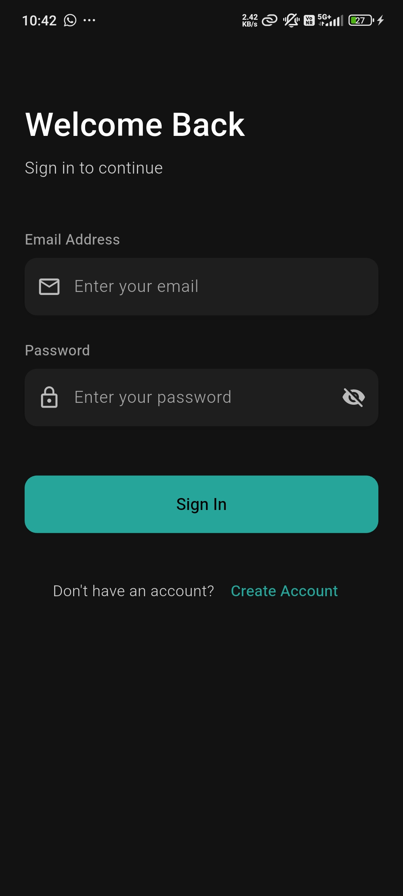
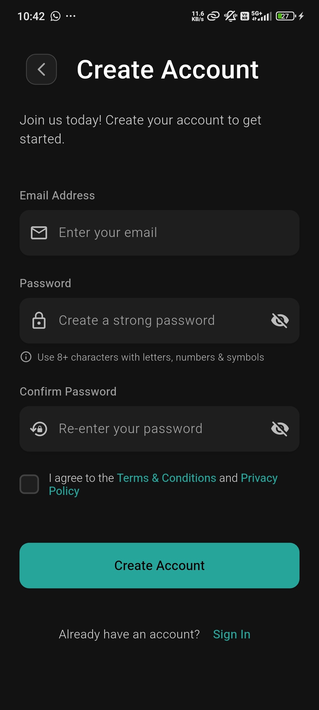
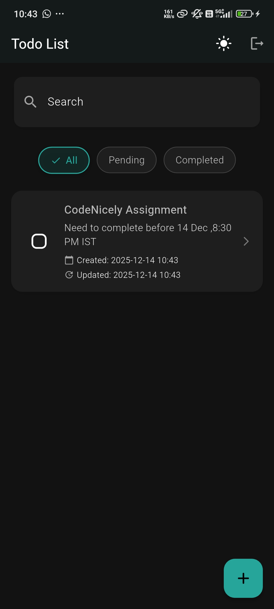
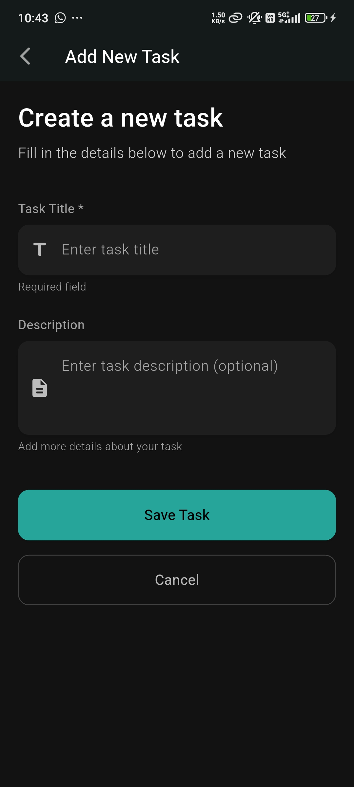
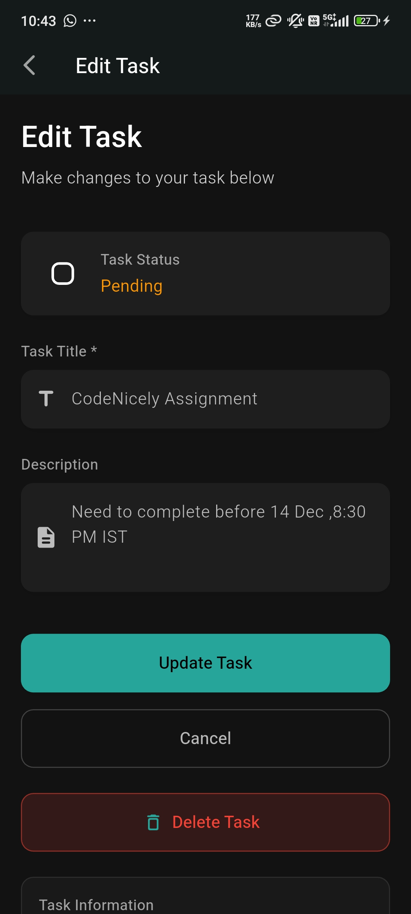

# Todo MVVM App 

## 📸 Screenshots

| Login Screen | Register Screen | Todo List | Add Todo | Edit Todo |
|--------------|-----------------|------------------------|
|  |  |  |  |  |

## 🎥 App Demo Video

https://github.com/user123/todo-mvvm-app/assets/12345678/abcdef12-3456-7890-abcd-ef1234567890

https://www.loom.com/share/abcdef1234567890  
(or YouTube / Drive link – whichever you prefer)

The video demonstrates:
- Register → Login → Auto-login after app restart
- Add, Edit, Delete, Toggle completion
- Search & Filter functionality
- Dark/Light mode toggle
- Logout (complete data clearance)

## 🚀 Features Implemented

### Required Features (All Completed) ✅
- **User Authentication**
  - Register & Login with email + password
  - Session persistence using Hive
  - Auto-login on app restart (persistent logged-in state)
  - **Logout clears everything** (session + all Todo data + app state reset)
- **Full Todo CRUD**
  - Add, Edit, Delete, View Todos
  - Toggle completion (Pending ↔ Completed)
  - Fields: Title, Description (optional), Created/Updated Date, Status
- **Local Database**
  - **Hive** used for fast, lightweight persistence
  - Todos and user session persist across app restarts
- **Strict MVVM Architecture**
  - No business logic in UI
  - Clean separation: Model → ViewModel → View → Repository
- **GetX Integration**
  - State management (Rx observables)
  - Routing (GetX routes)
  - Dependency Injection (Bindings)
- **Clean & Scalable Folder Structure**

### Bonus Enhancements (Extra Points) ✨
- **Search** Todos by title or description
- **Filter** by status (All / Pending / Completed)
- **Dark Mode** with theme toggle & persistent preference (saved in Hive)
- **Custom Modern Snackbar** (success, error, warning, info)
- **Form Validation** with real-time user feedback
- **Password Visibility Toggle**
- **Beautiful Empty State** with illustration
- **Polished Modern UI** (cards, shadows, consistent design)
- **Error Handling** throughout the app

## 📂 Project Structure

lib/
├── core/
│   ├── controllers/      # ThemeController
│   ├── utils/            # Custom Snackbar
│   ├── theme/            # AppTheme (light/dark)
│   ├── constant.dart
│   └── hive_init.dart
├── features/
│   ├── auth/
│   │   ├── controllers/  # AuthController
│   │   ├── models/       # User model + Hive adapter
│   │   ├── repositories/ # AuthRepository
│   │   └── views/        # LoginView, RegisterView
│   └── todo/
│       ├── controllers/  # TodoController
│       ├── models/       # Todo model + Hive adapter
│       ├── repositories/ # TodoRepository
│       └── views/        # TodoListView, AddTodoView, EditTodoView
├── routes/
│   └── app_pages.dart    # Routes, initial route logic, bindings
├── main.dart

## 🛠 Tech Stack

- **Flutter** – UI framework
- **GetX** – State, routing, DI
- **Hive** – Local NoSQL database
- **hive_flutter** – Hive integration
- **uuid** – Unique ID generation
- **path_provider** – App documents directory

## ⚙️ How to Run

1. Clone the repo:
   bash
   git clone https://github.com/Alokon5/todo_mvvm_app.git

2.  cd todo_mvvm_app

3.  flutter pub get

4.  flutter run
